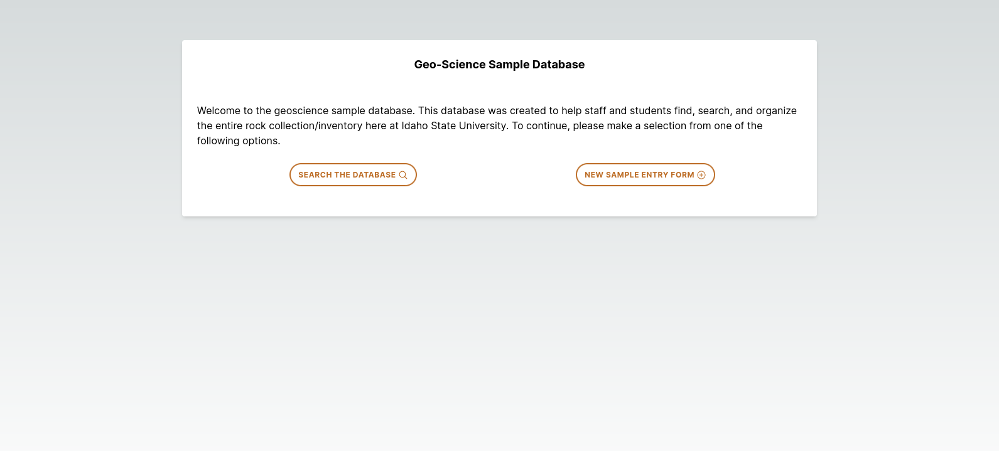
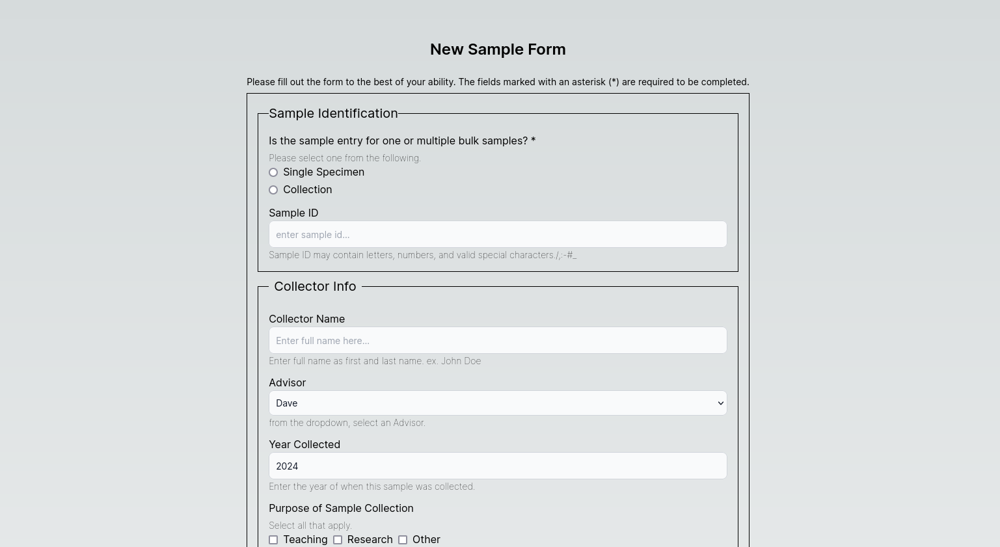

# isu-geoscience-inventory-client

Tailored for the Geoscience Department at Idaho State University, my web application offers an efficient inventory management solution adept at handling existing and preexisting samples. Utilizing the Next.js framework, React libraries, TypeScript, and Tailwind CSS, my tool provides a straightforward and user-friendly interface. Additionally, my application leverages the power of the Google Maps API to enhance location-based data visualization and analysis. From effortless sample data entry to streamlined database searches, this tool empowers the department with efficient sample management for research, teaching, and administrative needs.

### Usage

###### Welcome page



###### New Entry Form page



\*TODO: need to include either screenshots or a quick video walk through of all the functionalities

## Developer Instructions

### Dependencies

##### Prerequisites

- Node (v20.11.0 or higher)

##### Required

- React v18 or higher

```bash
npm install react react-dom
```

- Nextjs v14.1.0 or higher

```bash
npm install next
```

- Formik v2.4.5

```bash
npm install formik
```

- Axios v1.6.7 or higher

```bash
npm install axios
```

- @react-google-maps/api v2.19.3 or higher

```bash
npm install @react-google-maps/api
```

### Run

1. Navigate to the projects root directory

```bash
cd PATH_TO_PROJECT/isu-geoscience-inventory-client
```

2. Run the following command

```bash
npm run dev
```

### Contributing

Pull requests are welcome. For major changes, please open an issue first
to discuss what you would like to change.

Please make sure to update tests as appropriate.

---

---

This is a [Next.js](https://nextjs.org/) project bootstrapped with [`create-next-app`](https://github.com/vercel/next.js/tree/canary/packages/create-next-app).

## Getting Started

First, run the development server:

```bash
npm run dev
# or
yarn dev
# or
pnpm dev
# or
bun dev
```

Open [http://localhost:3000](http://localhost:3000) with your browser to see the result.

You can start editing the page by modifying `app/page.tsx`. The page auto-updates as you edit the file.

This project uses [`next/font`](https://nextjs.org/docs/basic-features/font-optimization) to automatically optimize and load Inter, a custom Google Font.

## Learn More

To learn more about Next.js, take a look at the following resources:

- [Next.js Documentation](https://nextjs.org/docs) - learn about Next.js features and API.
- [Learn Next.js](https://nextjs.org/learn) - an interactive Next.js tutorial.

You can check out [the Next.js GitHub repository](https://github.com/vercel/next.js/) - your feedback and contributions are welcome!

## Deploy on Vercel

The easiest way to deploy your Next.js app is to use the [Vercel Platform](https://vercel.com/new?utm_medium=default-template&filter=next.js&utm_source=create-next-app&utm_campaign=create-next-app-readme) from the creators of Next.js.

Check out our [Next.js deployment documentation](https://nextjs.org/docs/deployment) for more details.
